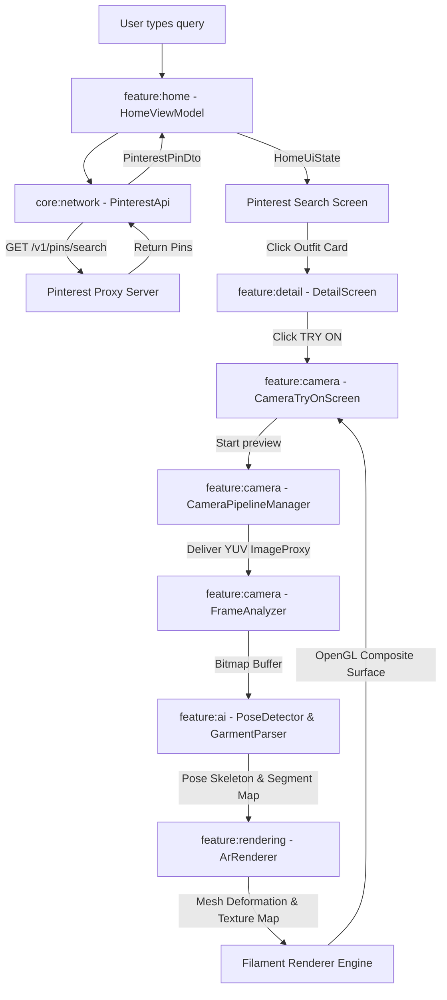
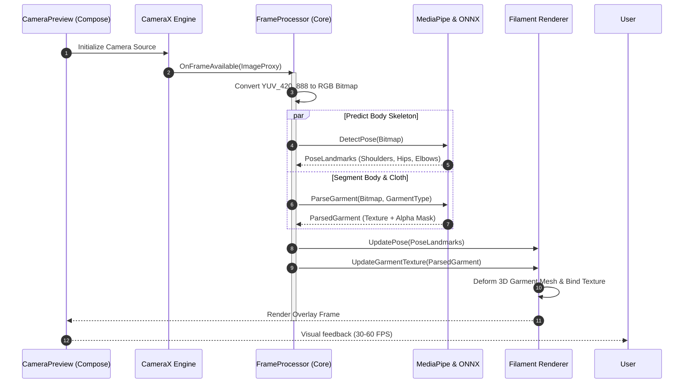

# Aura: AI-Powered Virtual Fashion Try-On Android Application

Aura is a modern, production-ready Android application designed for real-time virtual apparel fitting. Users can browse or search Pinterest outfits within the app, isolate garments, and instantly visualize those clothes mapped onto their body using a live camera feed. 

Unlike traditional apps, Aura **never uploads selfies or images of the user**; instead, it uses a high-performance local AI and AR rendering pipeline to deform, align, and simulate clothing textures directly over the device camera stream at 30–60 FPS.

---

## 1. Architectural Blueprint & Clean Layers

The project is structured under **Clean Architecture** guidelines, separating concerns into strict Gradle subprojects. Communication between presentation and data layers flows through the domain layer using **Unidirectional Data Flow (UDF)**.

### Subproject Layout

```
Aura/
├── gradle/
│   └── libs.versions.toml             # Catalog definition of all versions & libraries
├── settings.gradle.kts                # Subproject registrations
├── build.gradle.kts                   # Root build script
├── core/                              # Shared infrastructure libraries
│   ├── common/                        # Dispatchers, results, flow operators
│   ├── network/                       # Retrofit, serialization configuration, API interfaces
│   ├── database/                      # Offline database (Room), cached outfits, search logs
│   ├── security/                      # Keystore encryption & secure SharedPreferences
│   └── designsystem/                  # Material 3 typography, theme, and colors
└── feature/                           # UI features containing Clean subpackages
    ├── auth/                          # Email and Google Sign-in flow
    ├── home/                          # Pinterest outfit discovery, saved/recent dashboard
    ├── detail/                        # Pin details, palette extraction, clothing parser trigger
    ├── camera/                        # CameraX lifecycle handling, frame buffers, and overlays
    ├── ai/                            # MediaPipe skeleton tracking, TFLite body parsing
    ├── rendering/                     # 3D Filament renderer, cloth deformation, OpenGL anchors
    ├── shopping/                      # Product similarity APIs, Custom Tabs merchant browser
    └── profile/                       # User settings, saved fits, and history log
```

### Clean Architecture Layers Within Modules

Each feature module is organized internally by:
- **Presentation:** UI layouts (Jetpack Compose), states (StateFlow), and ViewModels (Hilt).
- **Domain:** Pure business logic entities, UseCases, and Repository Interfaces.
- **Data:** Repositories, API implementations, and local database access maps.

---

## 2. UML Architecture & Data Flow Diagrams

### Data Flow Diagram: Pinterest Discovery to AR Try-On



### Sequence Diagram: Camera Frame Analysis & Real-Time Render Pipeline



---

## 3. Core Interface & Pipeline Specifications

### Camera Pipeline (`CameraPipelineManager.kt`)
Manages Android CameraX lifecycle bindings, stream configuration, and fallback error states.

```kotlin
package com.aura.feature.camera.domain

import androidx.camera.core.ImageAnalysis
import androidx.lifecycle.LifecycleOwner
import kotlinx.coroutines.flow.SharedFlow

sealed interface CameraState {
    object Idle : CameraState
    object Initializing : CameraState
    object Active : CameraState
    data class Error(val exception: Throwable) : CameraState
}

interface CameraPipelineManager {
    val cameraState: SharedFlow<CameraState>

    fun bindCamera(
        lifecycleOwner: LifecycleOwner,
        surfaceProvider: androidx.camera.core.Preview.SurfaceProvider,
        imageAnalyzer: ImageAnalysis.Analyzer
    )

    fun unbindCamera()
    fun toggleFlash(enabled: Boolean)
}
```

### AI Inference Pipeline (`TryOnInferenceEngine.kt`)
Combines Pose coordinates and garment segments to compute overlay transformations.

```kotlin
package com.aura.feature.ai.domain

import android.graphics.Bitmap
import com.aura.feature.ai.model.PoseLandmarks

data class TryOnResult(
    val outputBitmap: Bitmap,
    val fps: Float
)

interface TryOnInferenceEngine {
    suspend fun processFrame(
        cameraFrame: Bitmap,
        poseLandmarks: PoseLandmarks,
        garment: ParsedGarment
    ): Result<TryOnResult>
}
```

### AR Rendering Pipeline (`ArRenderer.kt`)
Integrates the Filament graphics engine with Android SurfaceViews to render distorted cloth textures.

```kotlin
package com.aura.feature.rendering.domain

import android.view.SurfaceView
import com.aura.feature.ai.model.PoseLandmarks
import com.aura.feature.ai.domain.ParsedGarment

interface ArRenderer {
    fun attachSurface(surfaceView: SurfaceView)
    fun detachSurface()
    fun updatePose(pose: PoseLandmarks)
    fun updateGarmentTexture(garment: ParsedGarment)
    fun setRenderingParameters(brightness: Float, smoothingFactor: Float)
}
```

---

## 4. API & Database Schemas

### Offline Cache Database

Saved outfits are persisted locally using **Room Database**.

```kotlin
@Database(entities = [SavedOutfitEntity::class], version = 1, exportSchema = false)
abstract class AppDatabase : RoomDatabase() {
    abstract fun savedOutfitDao(): SavedOutfitDao
}

@Entity(tableName = "saved_outfits")
data class SavedOutfitEntity(
    @PrimaryKey val id: String,
    val title: String,
    val description: String?,
    val imageUrl: String,
    val sourceUrl: String?,
    val savedAt: Long
)
```

### Pinterest Proxy Endpoints

The app communicates with our proxy servers to securely resolve Pinterest Search.

```kotlin
interface PinterestApi {
    @GET("v1/pins/search")
    suspend fun searchPins(
        @Query("query") query: String,
        @Query("cursor") cursor: String?,
        @Query("limit") limit: Int = 20
    ): PinSearchResponse

    @GET("v1/pins/trending")
    suspend fun getTrendingPins(
        @Query("limit") limit: Int = 20
    ): List<PinterestPinDto>
}
```

---

## 5. Security & Tokens Framework

Sensitive access tokens are encrypted at rest using the Android Keystore with `EncryptedSharedPreferences`.

```kotlin
class TokenStorage @Inject constructor(@ApplicationContext context: Context) {
    private val masterKeyAlias = MasterKeys.getOrCreate(MasterKeys.AES256_GCM_SPEC)
    private val sharedPreferences = EncryptedSharedPreferences.create(
        "aura_secure_prefs",
        masterKeyAlias,
        context,
        EncryptedSharedPreferences.PrefKeyEncryptionScheme.AES256_SIV,
        EncryptedSharedPreferences.PrefValueEncryptionScheme.AES256_GCM
    )
    fun saveAccessToken(token: String) = sharedPreferences.edit().putString("access_token", token).apply()
    fun getAccessToken(): String? = sharedPreferences.getString("access_token", null)
    fun clearSession() = sharedPreferences.edit().remove("access_token").apply()
}
```

---

## 6. How to Build & Run Tests

Aura uses the Gradle Version Catalog (`libs.versions.toml`) to compile packages.

### Compile Project
```bash
./gradlew assembleDebug
```

### Run Unit Tests
```bash
./gradlew testDebugUnitTest
```

---

## 7. Future Scalability Recommendations

1. **Swapping Local ONNX with Server-side Diffusion:**
   - Real-time previews require local execution (MediaPipe Pose + custom TFLite models) to guarantee 30–60 FPS.
   - When the user taps "Capture Outfit", the app will send a high-resolution frame to our GPU backend server running diffusion try-on pipelines (`IDM-VTON` or `CatVTON`) to generate a realistic image swap.
2. **Expanding to Footwear and Accessories:**
   - Incorporate `MediaPipe Iris` and `MediaPipe Hand` tracking to support jewelry and smart glasses.
   - Add coordinate anchors in the AR engine to dynamically resize shoe models on foot anchors.
